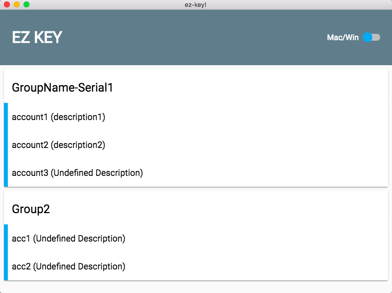

## About
This project was first use to solve some annoying errands during UAT.

We need to apply lots of accounts(eg. telephone number) for different test items. They all have individual usage in various different circumstance and often lead to a mess. So it inspires me to design a management tool.

This tool can help you grouping your testing accounts obvious at a glance. You can share those grouped accounts to each participants. And once you connect your android phone with ADB environment been set up, it will help us deal with the login process, there is no need to key-in account/password yourself in virtual keyboard and no more typo anymore. You can focus on features you truly need to test.



## Install

**Mac**

Download Dependencies with npm.

```sh
npm install
```

Run the bellow scripts to package your app on production. It will create a ez-key-darwin-x64 folder for you.

```sh
npm run build
npm run package
```

## Usage

Edit and distribute your group config in input.txt. The line leading with "#" will count as a new group. The lines after it until next "#" will treat as its account list. Bellow is a example.

```
# GroupName-Serial1
account1 password1 description1
account2 password2 description2
account3 password3

# Group2
acc1 pwd
acc2 pwd
```

**Customized Style**

Install [SASS](http://sass-lang.com/) first.

```sh
sudo gem install sass
sass -v
```

Compile scss file for css.

```sh
npm run sass
```

## Remark

There are issues around Mac **launchd function**. It will discards enviroment variable $PATH which declares in your .bash_profile file. So don't forget calling `fixPath()` before using command like `adb shell input` or you'll get "command not found error". Thanks for [fix-path](https://github.com/sindresorhus/fix-path) module.

Ths module [asar](https://github.com/electron/asar) will [copy your batch out](https://github.com/electron/electron/issues/3512) to `/var`, so always use `execFile` instead of `spawn` or `exec`.
